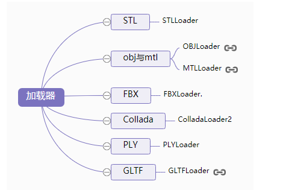

# Threejs导出模型信息

* Geometry、Material、Light、Object3D等类，提供了一个.toJSON()方法
* 通过这个方法可以导出Threejs三维模型的各类数据
* 该方法的功能就是把Threejs的几何体、材质、光源等对象转化为JSON格式导出

## 导出几何体信息

```js
var geometry = new THREE.BoxGeometry(100, 100, 100);
// 控制台查看立方体数据
console.log(geometry);
// 控制台查看geometry.toJSON()结果
console.log(geometry.toJSON());
// JSON对象转化为字符串
console.log(JSON.stringify(geometry.toJSON()));
// JSON.stringify()方法内部会自动调用参数的toJSON()方法
console.log(JSON.stringify(geometry))
```

## 导出材质信息

```js
var material = new THREE.MeshLambertMaterial({
  color: 0x0000ff,
}); //材质对象Material
console.log(material);
console.log(material.toJSON());
console.log(JSON.stringify(material));
```

## 导出场景scene信息

```js
var mesh = new THREE.Mesh(geometry, material); //网格模型对象Mesh
scene.add(mesh); //网格模型添加到场景中
console.log(scene);
console.log(scene.toJSON());
```

# 自定义模型加载器文件

* Threejs在three.js-master\examples\js\loaders目录下会提供一系列的加载器
* 这些加载器本质上都是解析模型文件的字符串
* 通过正则表达式提取相关的顶点、材质等信息转化为Threejs自身的类表示的对象



```js
/ 如果编写通用的材质加载器需要枚举所有的材质，这里没有列举完
var typeAPI = {
  MeshLambertMaterial: THREE.MeshLambertMaterial,
  MeshBasicMaterial: THREE.MeshBasicMaterial,
  MeshPhongMaterial: THREE.MeshPhongMaterial,
  PointsMaterial: THREE.PointsMaterial,
}
// 创建一个文件加载器，该加载器是对异步加载的封装
var loader = new THREE.FileLoader();
loader.load('material.json', function(elem) {
  console.log(elem);// 查看加载返回的内容
  var obj = JSON.parse(elem);// 字符串转JSON对象
  console.log(obj);// 查看转化结果
  var geometry = new THREE.BoxGeometry(100, 100, 100);
  /**
   * 解析材质数据
   */
  // 根据type的值判断调用threejs的哪一个API
  var material = new typeAPI[obj.type]();
  // 从obj.color中提取颜色
  // 16711935对应颜色0xFF00FF  255对应颜色0x0000FF
  material.color.r = (obj.color >> 16 & 255) / 255; //获取颜色值R部分
  material.color.g = (obj.color >> 8 & 255) / 255; //获取颜色值G部分
  material.color.b = (obj.color & 255) / 255; //获取颜色值B部分

  var mesh = new THREE.Mesh(geometry, material); //网格模型对象Mesh
  scene.add(mesh); //网格模型添加到场景中
})
```

## 加载Three.js导出的模型数据

### 缓冲几何体数据加载器

```js
var loader = new THREE.BufferGeometryLoader();
loader.load('bufferGeometry.json',function (geometry) {
  // 控制台查看加载放回的threejs对象结构
  console.log(geometry);
  var material = new THREE.MeshLambertMaterial({
    color: 0x0000ff,
  }); //材质对象Material
  var mesh = new THREE.Mesh(geometry, material); //网格模型对象Mesh
  scene.add(mesh); //网格模型添加到场景中
})
```

### 网格模型Mesh加载

包含几何体Geometry和材质Material

```js
var loader = new THREE.ObjectLoader();
loader.load('model.json',function (obj) {
  console.log(obj);
console.log(obj.type);
  obj.scale.set(100,100,100)
  scene.add(obj)
})
```

### 加载组Group对象

```js
loader.load('group.json', function(obj) {
  console.log(obj);
  console.log(obj.type);
  scene.add(obj)
})
```

### 加载场景对象

场景对象不仅包含模型，还包括光源对象

```js
loader.load('scene.json',function (obj) {
  console.log(obj);
  console.log(obj.type);
  obj.scale.set(100,100,100)
  scene.add(obj)
})
```